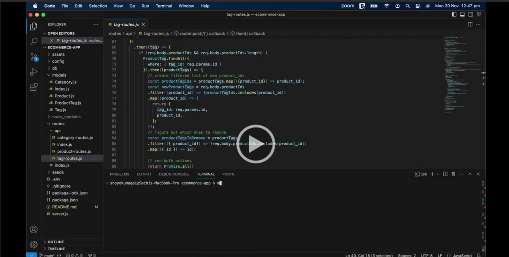

# E-commerce Application

## Description

This is an E-commerce back-end application for an Internet Retail company that uses the latest technologies to create, modify and delete company product information.

## Link to video demo
You can find the Demo of the application below.

The demo shows how the application works using the REST API calls of GET, POST, PUT and DELETE

## Credits

The underlying technologies used in this application are Express JS, MySQL, and Sequalize, please find the documentations below:
- [Express JS](https://expressjs.com/)
- [Mysql](https://www.npmjs.com/package/mysql2)
- [Sequalize](https://sequelize.org/docs/v6/getting-started/)

